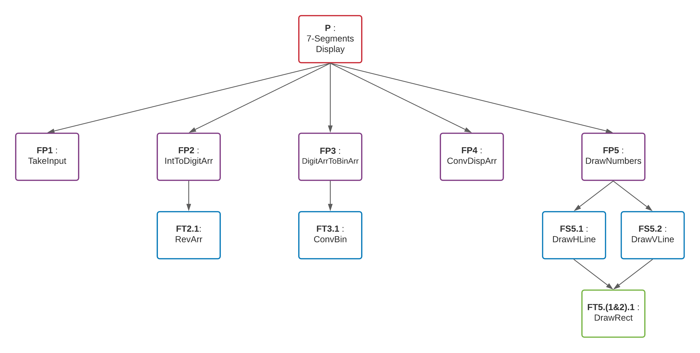
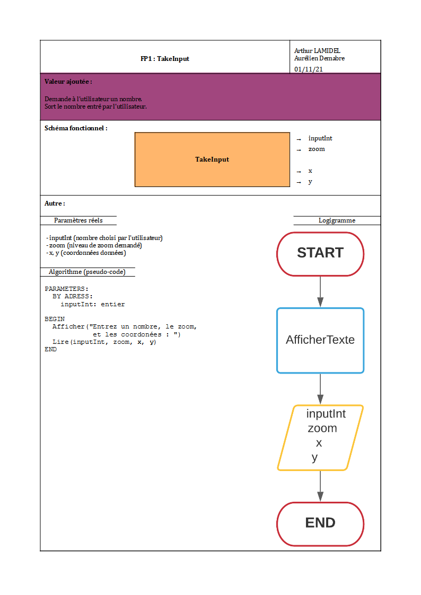
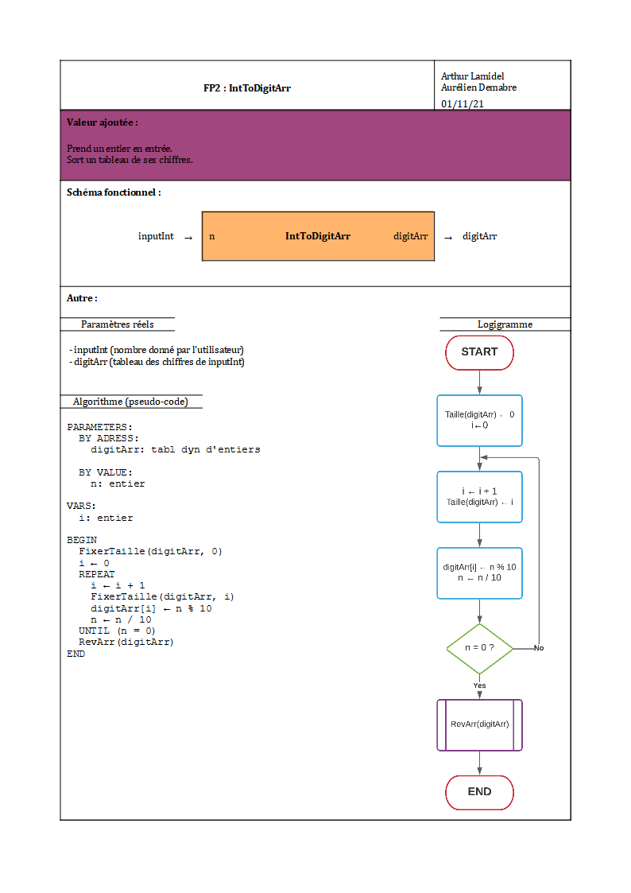
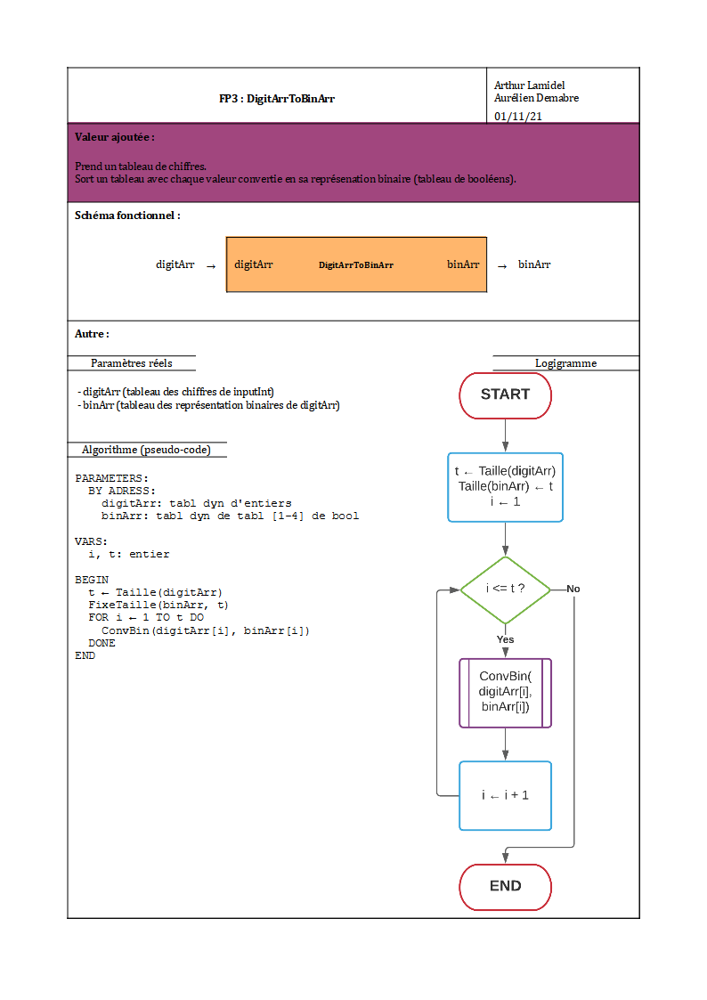
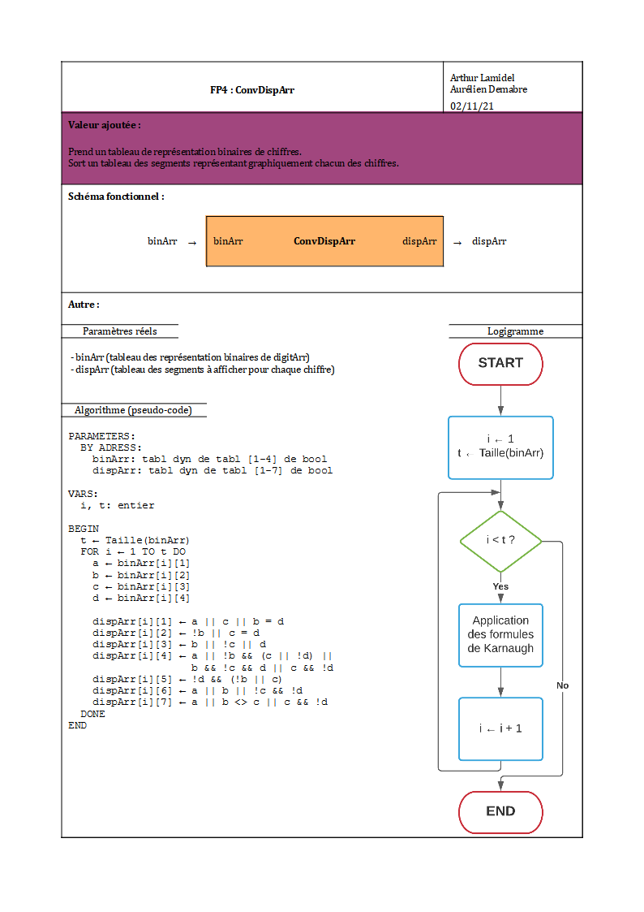
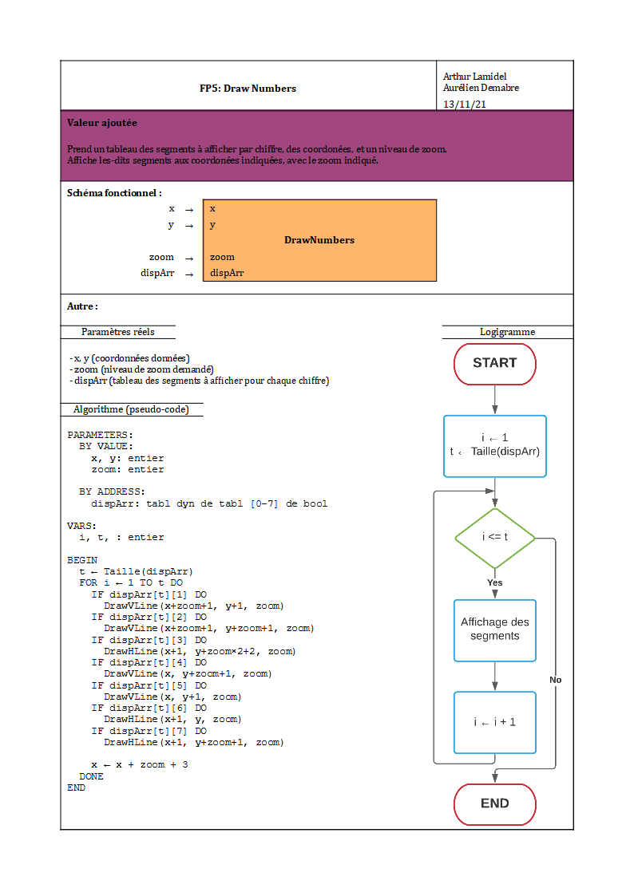
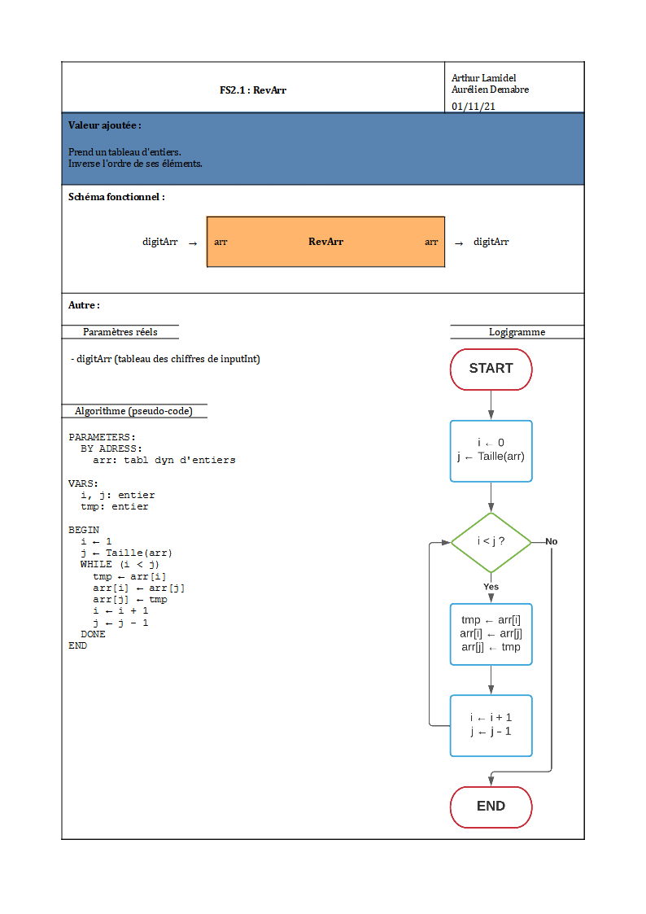
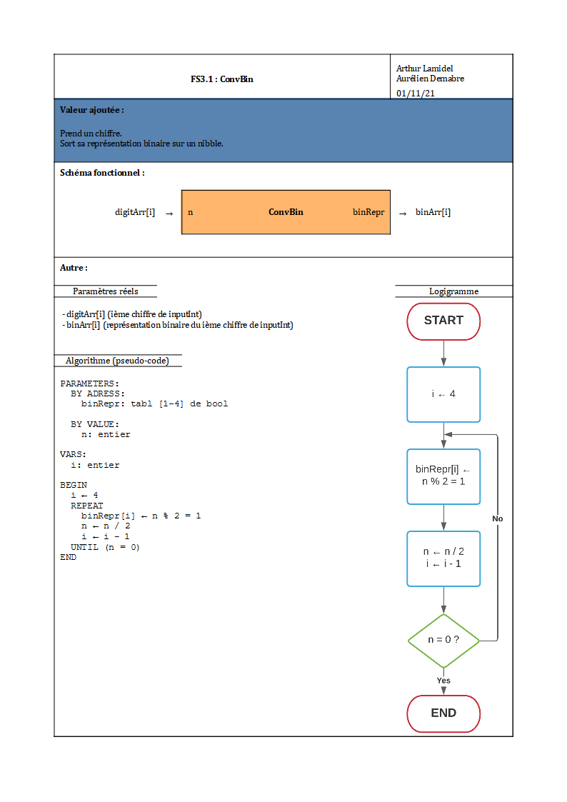
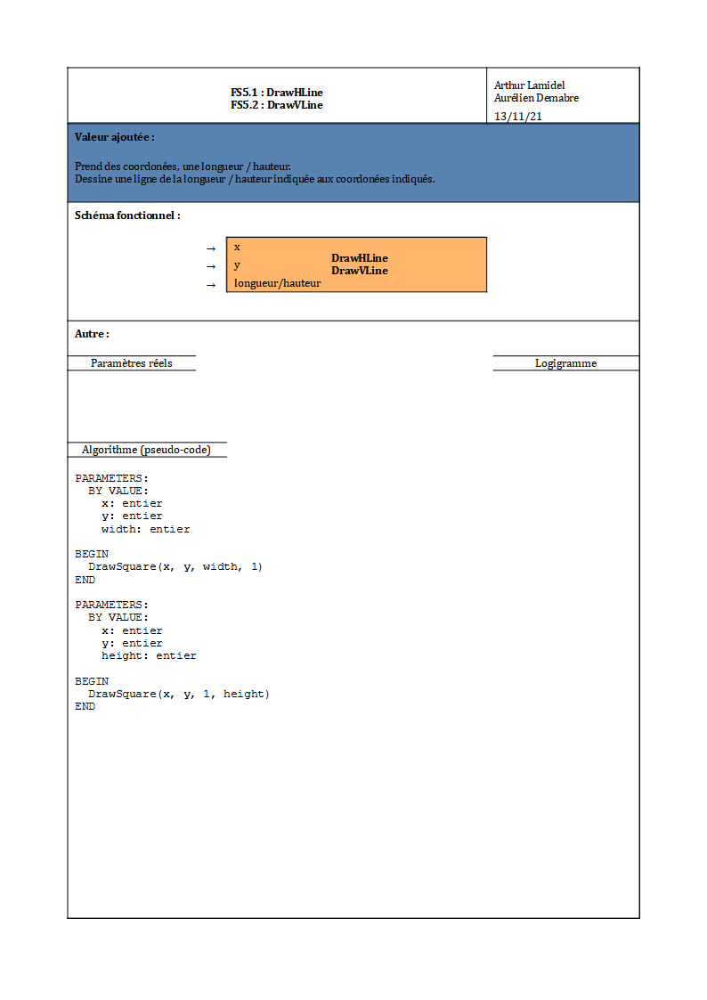

# BCD-Decoder

Projet d'affichage d'un nombre sur un 7-segment.  
Auteurs: **H2WO4**, **Samy8z**

***
***

## Options incluses

- Entrée d'un nombre plutôt qu'un chiffre
- Entrée d'un niveau de zoom

***
***

## Raisonement derrière l'analyse

1. Étape d'entrée des données.  
 Sa place en premier et évidente et nécessaire.

2. Étape de division du nombre en tableau de chiffres.  
 L'algorithme suivant ne marche que sur des chiffres, il est donc nécessaire de d'abord transformer le nombre.
   1. Procèdure pour inverser un tableau.  
    Ne sachant pas la taille du nombre, la méthode utilisée nous donnera le tableau dans l'ordre inverse. Cette procèdure vient corriger cela.

3. Étape de conversion des chiffres en nibbles.  
 L'algorithme suivant opère sur la représentation en base 2 d'un chiffre, il est donc nécessaire de d'abord transformer chaque chiffre.  
 Contrairement au 2., la taille du tableau est connue à l'avance, et il n'y a pas besoin d'inverser le tableau.
   1. Procédure pour convertir un chiffre en nibble.
    Pour éviter de rendre le code illisible en embriquant des boucles FORs non-triviale, il a été jugé nécessaire de séparer ceci dans sa propre procédure.

4. Étape de conversion des nibbles en représentation 7-segments.  
 L'affichage nécéssite un tableau des segments à afficher, il est donc nécessaire de d'abord transformer chaque chiffre.

5. Étape d'affichage des chiffres.  
 Maintenant que les données sont dans un format utilisable, nous pouvont les afficher à l'écran.
   1. / ii. Procéure pour afficher un trait horizontal / vertical.  
    Ce morceau de code est réutilisé plusieurs fois avec des paramètres différents, il a donc été jugé judicieux d'en faire ça propre procédure.
      1. Procédure pour afficher un rectangle.  
       Les deux procédures précédentes sont très similaires, pour éviter la répétition de code, il a été jugé plus élégant de les faire "hériter" d'une procédure mère.

***
***

## Équation de Karnaugh

> TODO

***
***

## Éventuels bugs

- Entrée d'un nombre supérieur à 32767. (Overflow, mais pas de crash)
- Entrée d'un nombre négatif. (Affiche uniquement des 0)
- Entrée d'un zoom de 0. (N'affiche rien, correspond au résultat attendu)
- Entrée de coordonées négatives. (Affiche n'importe quoi)

***
***

## Ordre de programmation

1. Groupe FP5  
 Pour pouvoir tester les étapes de data-process, le mieux et de commençer par le data-out.
   - FT5.(1&2).1 → FS5.1 & FS5.2 → FP5  
    Ainsi, il suffit de remonter dans l'arbre, en partant donc du bas.

2. FP4 → FS3.1 → FP3 → FP2.1 → FP2  
 Nous pouvons donc commencer le data-process, par la fin, car cela nous permet de directement envoyer le résultat de cette procédure dans le data-out, FP5.

3. FP1  
 Maintenant que le data-process et le data-out sont fonctionels, nous pouvont programmer le data-in, et nous pouvons, sans aucune difficulté s'assurer qu'il fonctionne.

***
***

## Fiches de programmation

***

***

***

***

***

***

***

***
.1.png)
